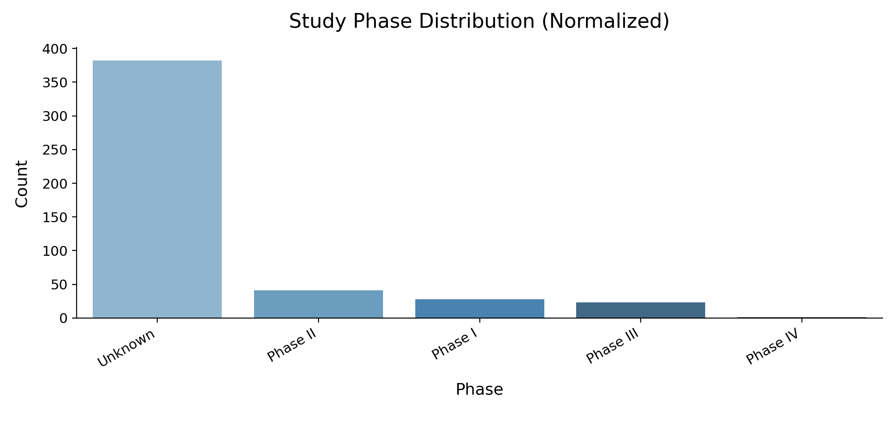
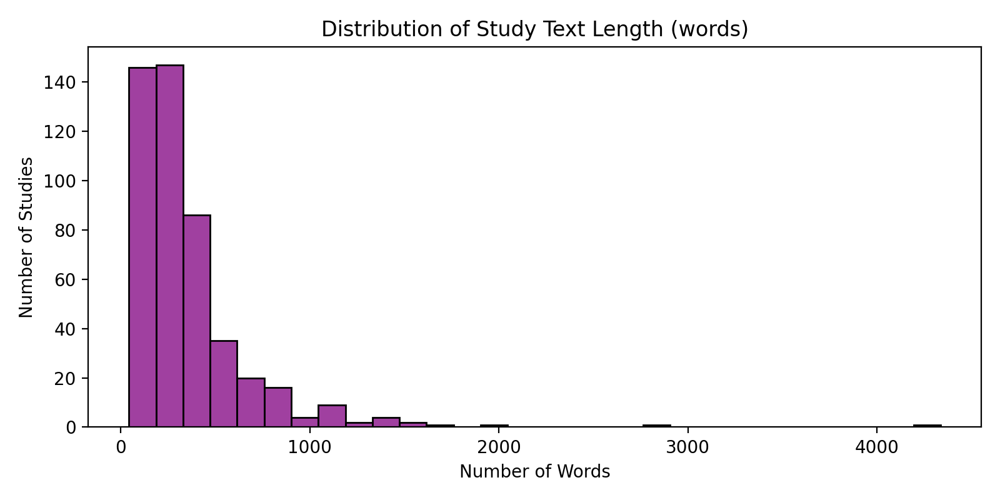
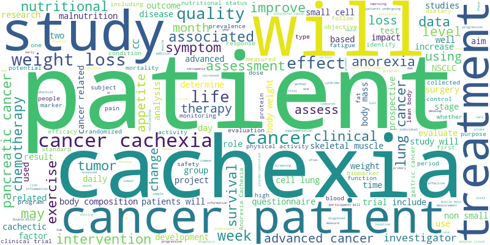
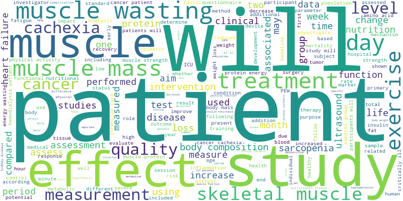
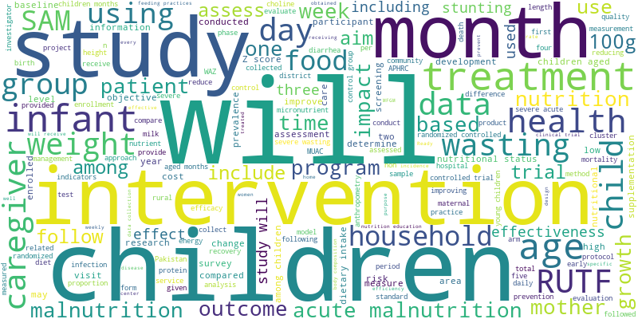
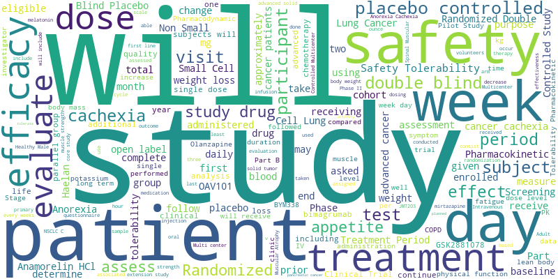
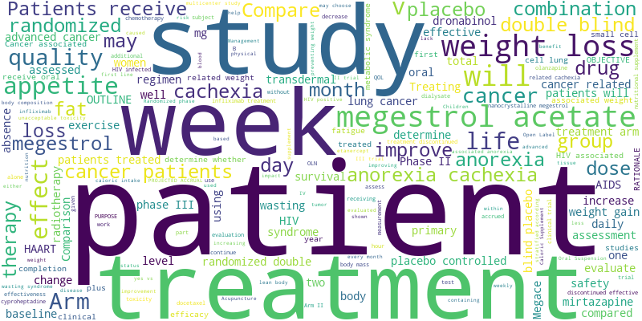
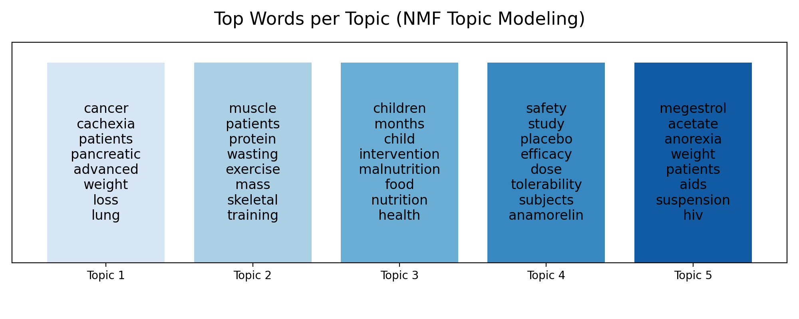
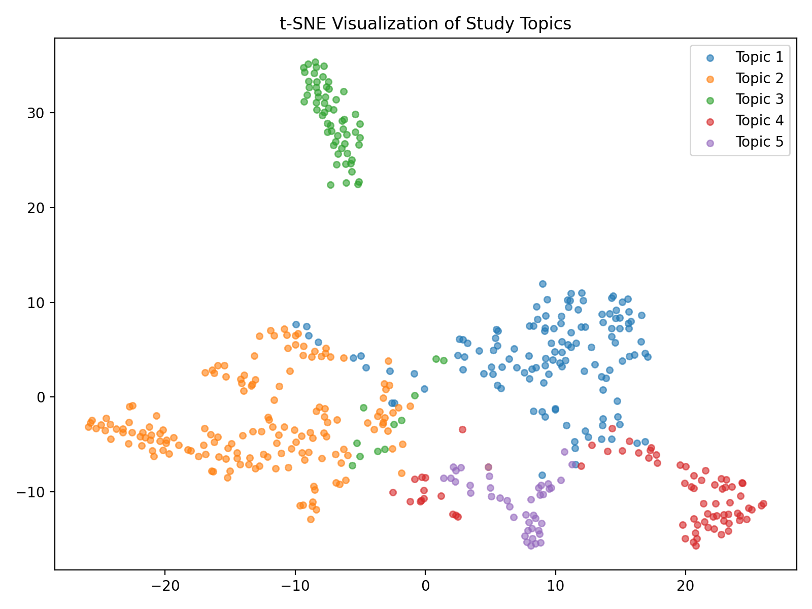

# Comprehensive Analysis of Cachexia Clinical Trial Texts

**Date:** May 5, 2025

**1. Executive Summary**

This report details the Natural Language Processing (NLP) analysis performed on the textual content (titles, summaries, descriptions) of 475 clinical trials related to cachexia, fetched from ClinicalTrials.gov. The analysis aimed to characterize the study landscape through attribute extraction, topic modeling, and content analysis. Key findings include a high prevalence of studies where the phase could not be reliably determined from the text using simple methods, and the identification of five distinct thematic clusters within the trials: (1) Cancer Cachexia & Treatment, (2) Muscle Wasting & Exercise Physiology, (3) Pediatric Malnutrition & Nutritional Interventions, (4) Drug Safety, Efficacy & Tolerability (featuring Anamorelin), and (5) Megestrol Acetate for Anorexia/Weight Loss (often in HIV/AIDS contexts). While providing valuable preliminary insights, the limitations of traditional NLP methods highlight significant opportunities for leveraging Large Language Models (LLMs) to achieve more robust, nuanced, and scalable extraction and analysis for scorecard generation.

**2. Methodology**

The analysis utilized text data extracted from the `data/nlp/cachexia_studies_fetched_nlp_texts.json` file, which contains concatenated narrative fields (official/brief titles, brief summary, detailed description) for each study. The following NLP techniques were employed using Python libraries (`scikit-learn`, `wordcloud`, `seaborn`, `matplotlib`):

*   **Attribute Extraction:** Regular expressions (regex) were used to extract potential mentions of Study Phase, Target Enrollment, and Primary Endpoint from the text. Phase labels were subsequently normalized to standardize variations (e.g., "phase II", "Phase 2" -> "Phase II").
*   **Topic Modeling:** Non-negative Matrix Factorization (NMF) was applied to a TF-IDF (Term Frequency-Inverse Document Frequency) representation of the study texts to identify 5 latent topics.
*   **Content & Statistical Analysis:** Wordclouds, n-gram (bigram) frequency analysis, study text length distribution, and t-SNE visualization of topic assignments were performed to further characterize the corpus and topic model results.

All results, including plots, data files, and summaries, are stored in the `data/nlp/` directory.

**3. Results & Discussion**

**3.1. Study Characteristics**

*   **Phase Distribution:** The normalized phase distribution (see `data/nlp/phase_distribution.json` and figure below) reveals that the phase could not be reliably extracted via regex for the majority of studies (382 marked "Unknown"). Among those identified, Phase II (41 studies) and Phase I (28 studies) were the most common, followed by Phase III (23 studies) and Phase IV (1 study). This highlights a significant limitation of relying solely on simple text patterns for structured data extraction; phase information is often absent, ambiguously stated, or requires deeper contextual understanding.

    

*   **Study Length:** The distribution of study text length (figure below) shows variability, with most studies having texts between 100 and 1000 words. This suggests sufficient content for NLP analysis in most cases, although the variability might influence the performance of certain models.

    

**3.2. Topic Analysis**

The NMF topic modeling successfully identified 5 distinct themes (see `data/nlp/nlp_analysis_summary.txt`, `data/nlp/topic_modeling.png`, and wordclouds below):

1.  **Cancer Cachexia & Treatment:** (Keywords: cancer, cachexia, patients, pancreatic, advanced, weight, loss, lung, chemotherapy, treatment). This is the largest cluster, reflecting the strong association between cachexia and cancer.
    
2.  **Muscle Wasting & Exercise Physiology:** (Keywords: muscle, patients, protein, wasting, exercise, mass, skeletal, training, strength, ultrasound). Focuses on the physiological aspects of muscle loss and potential non-pharmacological interventions.
    
3.  **Pediatric Malnutrition & Nutritional Interventions:** (Keywords: children, months, child, intervention, malnutrition, food, nutrition, health, rutf, nutritional). A distinct cluster focusing on nutritional challenges and interventions in pediatric populations.
    
4.  **Drug Safety, Efficacy & Tolerability:** (Keywords: safety, study, placebo, efficacy, dose, tolerability, subjects, anamorelin, drug, evaluate). Centers on the evaluation of therapeutic agents, with Anamorelin appearing prominently.
    
5.  **Megestrol Acetate & Anorexia/Weight Loss:** (Keywords: megestrol, acetate, anorexia, weight, patients, aids, suspension, hiv, placebo, loss). Focuses on a specific drug intervention, often in the context of HIV/AIDS-related wasting.
    

*   **Prevalence & Visualization:** Topic 1 (Cancer Cachexia) is the most prevalent (`data/nlp/topic_prevalence.json`). The t-SNE visualization (figure below) shows reasonable separation between the topics, particularly the pediatric cluster (Topic 3), suggesting the model captured meaningful distinctions. Representative study snippets (`data/nlp/topic_representative_studies.txt`) offer concrete examples of trials belonging to each topic.

    
    

**3.3. Content Analysis**

*   **N-grams:** The top bigrams (`data/nlp/top_bigrams.txt`) reinforce the topic findings, with phrases like "weight loss", "pancreatic cancer", "muscle mass", "non small", "cell lung", "lung cancer", "safety tolerability", and "megestrol acetate" appearing frequently. This indicates recurring concepts and terminology within the cachexia trial landscape.

**4. Limitations**

The current analysis, while informative, has limitations inherent to the methods used:

*   **Regex Fragility:** Attribute extraction via regex is brittle and likely under-reports true values (as seen with study phase). It cannot handle complex phrasing or infer information not explicitly stated in a predictable pattern.
*   **Bag-of-Words Assumption:** TF-IDF + NMF treats documents as bags of words, ignoring syntax, semantics, and word order, which limits the depth of topic understanding.
*   **Basic Summarization:** Truncating text provides only a rudimentary summary.
*   **Lack of Semantic Understanding:** The methods lack deep semantic understanding, preventing nuanced classification or extraction based on context.

**5. Next Steps: Leveraging Large Language Models (LLMs)**

The limitations above present clear opportunities to leverage LLMs, aligning with the project's goal of evaluating different LLM workflows for scorecard generation. LLMs can potentially replace or significantly enhance several parts of this NLP pipeline:

*   **Attribute Extraction (Replacing Regex):**
    *   **Single LLM / Multi-Agent:** An LLM (or specialized agents) could be prompted to read the `nlp_text` and extract attributes like Phase, Enrollment, Endpoints, Intervention Model, Status, etc., in a structured format (e.g., JSON). LLMs are adept at understanding natural language variations and context, likely yielding far better results than regex, especially for fields like "Phase" or complex "Primary Endpoint" descriptions. This directly addresses the "Single LLM" and "Multi-Agentic" approaches outlined in the README.
    *   **Evaluation:** Compare LLM-extracted attributes against the "Gold Std" (manual JSON parsing or expert curation) mentioned in the README matrix.
*   **Classification (Semantic Phase/Status):**
    *   Instead of relying on simple keyword matching, an LLM could perform zero-shot or few-shot classification of study phase or status based on the semantic content of the entire text, potentially inferring the phase even if not explicitly stated in a standard format.
*   **Summarization (Generating Scorecard Content):**
    *   LLMs can generate abstractive summaries tailored to specific requirements (e.g., a concise summary of PICO elements for the scorecard), far surpassing simple text truncation. Different prompting strategies (single prompt vs. agent-based summarization) can be tested.
*   **Enhanced Topic Modeling / Clustering:**
    *   LLM embeddings (obtained via models like Sentence-BERT or OpenAI's embedding models) could be used with clustering algorithms (e.g., K-Means, HDBSCAN) to potentially identify more semantically coherent or even hierarchical topics compared to NMF.
*   **Retrieval-Augmented Generation (RAG):**
    *   The `nlp_text` field for all 475 studies is ideal for building a RAG knowledge base. The texts can be chunked, embedded, and stored in a vector database. An LLM coupled with this retriever could answer specific questions about the cachexia trials (e.g., "Which trials investigated Anamorelin in lung cancer patients?", "Summarize the primary endpoints used in Phase III cachexia trials"). This directly implements the "LLM w/ RAG" approach.

**6. Conclusion**

The NLP analysis provided a valuable overview of the cachexia clinical trial landscape, identifying key research themes and highlighting data characteristics. However, the limitations of traditional NLP techniques, particularly for robust attribute extraction from unstructured text, are evident. The next logical step is to systematically evaluate the potential of LLMs (using Single LLM, Multi-Agent, and RAG approaches) to perform these tasks with higher accuracy, nuance, and scalability, ultimately aiming to automate the generation of informative clinical trial scorecards. The current analysis serves as a strong baseline and motivation for pursuing these advanced LLM-driven workflows.
